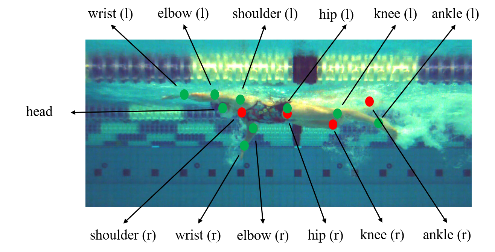

<!-- PROJECT SHIELDS -->
<!--
*** I'm using markdown "reference style" links for readability.
*** Reference links are enclosed in brackets [ ] instead of parentheses ( ).
*** See the bottom of this document for the declaration of the reference variables
*** for contributors-url, forks-url, etc. This is an optional, concise syntax you may use.
*** https://www.markdownguide.org/basic-syntax/#reference-style-links
-->
[![Contributors][contributors-shield]][contributors-url]
[![Forks][forks-shield]][forks-url]
[![Stargazers][stars-shield]][stars-url]
[![Issues][issues-shield]][issues-url]
[![LinkedIn][linkedin-shield]][linkedin-url]


<!-- PROJECT LOGO -->
<br />
<p align="center">
  <a href="https://github.com/agvdndor/Swimming-Stroke-Rate-Analysis">
    
  </a>

  <h3 align="center">Swimming Stroke Rate Analysis</h3>

  <p align="center">
    Automatically mine stroke rates from underwater video of swimmers over varying windows of time resolution.
    <br />
    <br />
    <a href="https://github.com/agvdndor/Swimming-Stroke-Rate-Analysis">Report Bug</a>
    ·
    <a href="https://github.com/agvdndor/Swimming-Stroke-Rate-Analysis">Request Feature</a>
  </p>
</p>


<!-- TABLE OF CONTENTS -->
## Table of Contents

* [About the Project](#about-the-project)
  * [Abstract](#Abstract)
  * [Framework](#Framework)
  * [Results](#Results)
* [Getting Started](#getting-started)
  * [Prerequisites](#prerequisites)
  * [Installation](#installation)
  * [Dataset](#Dataset)
* [License](#license)
* [Acknowledgements](#acknowledgements)


<!-- ABOUT THE PROJECT -->
## About The Project

This project was realized as a thesis to obtain a Master of Engineering in Computer Science at Ghent University. For a comprehensive explanation of methods and results, please consult the [academic summary](assets/pdf/academic_summary.pdf).


### Abstract
Advances in the field of human pose estimation have significantly improved performance across complex datasets. However, current solutions that were designed and trained to recognize the human body across a wide range of contexts, e.g. MS COCO, often do not reach their full potential in very specific and challenging environments. This impedes subsequent analysis of the results. Underwater footage of competitive swimmers is an example of this, due to frequent self-occlusion of body parts and the presence of noise in the water. This work aims to improve the performance of pose estimation in this context in order to enable an automatic analysis of kinematics. Therefore, we propose a framework that limits the search space for human pose estimation by using a set of anchor poses. More specifically, the problem is reduced to finding the best matching anchor pose and the optimal transformation thereof.
	To find this best match, we devise a method of assessing similarity between two poses and use the Viterbi algorithm to find the most likely sequence of anchor poses. Thereby, we effectively exploit the cyclic character of the swimming motion.
	This does not only improve pose estimation performance but also provides a method to reliably extract the stroke frequency, outperforming manual timings by a human observer.

### Framework
The proposed framework consists of 3 main steps
- **Baseline Prediction:** Estimation of 13 keypoints by an existing human pose estimation model (prefe rably finetuned on relevant dataset).

  <p align="center">
    
    
  </p>
  

- **Pose Matching:** Match the estimated pose to the most similar pose from a set of anchor poses. 


  <p align="center">
    
    
  </p>

- **Most Likely Sequence of Anchor Poses:** Use the Viterbi algorithm to obtain the most likely sequence of anchor poses given a series of consecutive pose predictions.

  
  <p align="center">
    
    
  </p>

### Results
  <p align="center">
    
  </p>

<!-- GETTING STARTED -->
## Getting Started

### Prerequisites

- Python3.6+
- Pip
- Virtualenv
- cuDNN7.+
- Docker (optional)

### Installation

1. Create environment and activate (Linux/Mac)
```sh
virtualenv -p python3 venv
source venv/bin/activate
```
2. Install requirements
```sh
pip install -r requirements.txt
```

### Dataset
Dataset was annotated with [Supervise.ly](supervise.ly) and exported as JSON. Take a look at [lib/dataset/PoseDataset.py](https://github.com/agvdndor/Swimming-Stroke-Rate-Analysis/blob/master/lib/dataset/PoseDataset.py) for format and naming conventions.

<!-- LICENSE -->
## License

Distributed under the MIT License.


<!-- ACKNOWLEDGEMENTS -->
## Acknowledgements
Please review the [academic summary](assets/pdf/academic_summary.pdf) for a full list of references and acknowledgements.

* [RMSD](https://github.com/charnley/rmsd)


<!-- MARKDOWN LINKS & IMAGES -->
<!-- https://www.markdownguide.org/basic-syntax/#reference-style-links -->
[contributors-shield]: https://img.shields.io/github/contributors/agvdndor/Swimming-Stroke-Rate-Analysis.svg?style=flat-square
[contributors-url]: https://github.com/agvdndor/Swimming-Stroke-Rate-Analysis/graphs/contributors
[forks-shield]: https://img.shields.io/github/forks/agvdndor/Swimming-Stroke-Rate-Analysis.svg?style=flat-square
[forks-url]: https://github.com/agvdndor/Swimming-Stroke-Rate-Analysis/network/members
[stars-shield]: https://img.shields.io/github/stars/agvdndor/Swimming-Stroke-Rate-Analysis.svg?style=flat-square
[stars-url]: https://github.com/agvdndor/Swimming-Stroke-Rate-Analysis/stargazers
[issues-shield]: https://img.shields.io/github/issues/agvdndor/Swimming-Stroke-Rate-Analysis.svg?style=flat-square
[issues-url]: https://github.com/agvdndor/Swimming-Stroke-Rate-Analysis/issues
[license-shield]: https://img.shields.io/github/license/othneildrew/Best-README-Template.svg?style=flat-square
[linkedin-shield]: https://img.shields.io/badge/-LinkedIn-black.svg?style=flat-square&logo=linkedin&colorB=555
[linkedin-url]: https://www.linkedin.com/in/arne-vandendorpe-8800/
[product-screenshot]: images/screenshot.png
